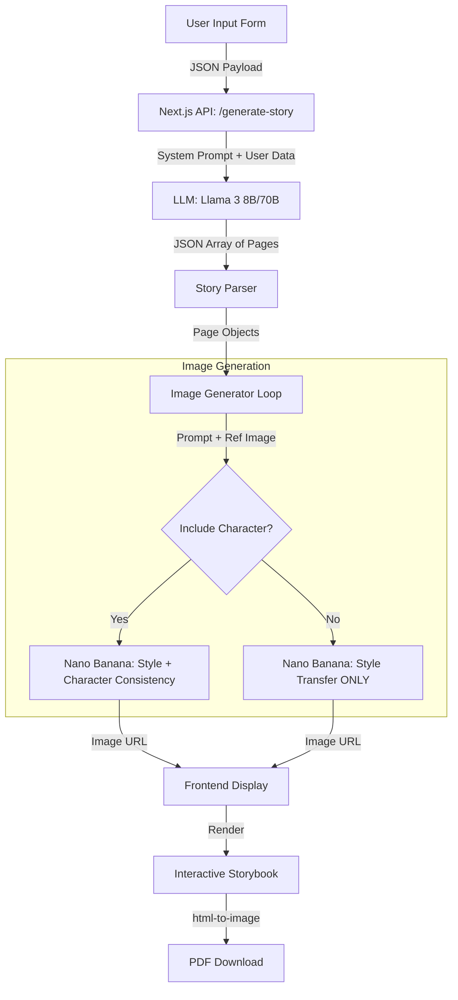

# Socially 🧩
*AI-Powered ABA-compliant Social Narratives Generator*

This tool is designed to help ABA clinicians create personalized, therapeutically sound Social Narratives for children. It leverages Large Language Models (LLMs) for text generation and consistent character-based image generation to produce high-quality educational materials.

## Recent Updates �

*   **Iterative Image Editing**: Users can now refine individual story panels. The system uses the current panel's image as a reference, allowing for precise adjustments while maintaining character consistency.
*   **Parallel Image Generation**: Significantly improved generation speed by processing story pages concurrently.
*   **iPad-First Design**: A new split-screen layout optimized for landscape tablet use, featuring a glassmorphism-styled control panel and a cinematic story display.
*   **Theme System**: Introduced "Socially" Dark Mode for low-light environments.
*   **Debug Logging**: Comprehensive server-side logging archives all prompts and automatically saves a PDF of every generated story for quality assurance.

## Core Features ✨

*   **Strict ABA Compliance**: The LLM is prompt-engineered to follow standard social narrative guidelines (sentence ratios, positive framing, first-person perspective).
*   **Character Consistency**: Uses the first generated image as an anchor reference for the rest of the story, ensuring the character looks the same across panels.
*   **Smart Scene Extraction**: Intelligently removes character descriptions for POV shots to avoid "clones".
*   **PDF Export**: One-click download of print-ready landscape PDFs.

## Architecture ⚙️

The application follows a multi-step generation pipeline:

### 1. Text Generation (LLM)
We utilize **Llama 3** with a specialized system prompt to ensure adherence to clinical guidelines. The model outputs structured JSON containing text, image prompts, and scene metadata.

### 2. Image Generation
We employ a hybrid approach:
*   **Google Nano Banana**: Used for scenes requiring character consistency (FaceID/Style Transfer).
*   **Flux Schnell**: Available for rapid prototyping or non-character scenes.

### 3. Debugging & Observability
Every generation run is assigned a unique `runId`.
*   **Logs**: `debug_logs/<runId>/prompts.log` captures full prompt chains.
*   **Artifacts**: `debug_logs/<runId>/story.pdf` is automatically archived upon completion.

## Tech Stack 🛠️

*   **Framework**: Next.js (App Router)
*   **Styling**: Tailwind CSS v4
*   **AI Models**:
    *   Text: `meta/meta-llama-3-70b-instruct` (Smart)
    *   Images: `google/nano-banana` (Consistent), `black-forest-labs/flux-2-dev` (High Fidelity)
*   **PDF**: `html-to-image` + `jspdf`

## Browser Compatibility 🌐

> [!WARNING]
> **Safari Users**: Due to Safari's aggressive resource optimization, the "Download PDF" button may generate a PDF with missing images on the first click. Clicking the button a second time resolves this issue.
>
> For the best experience, we recommend using **Google Chrome**, where PDF generation works perfectly on the first try.

## Getting Started

1.  Clone the repository.
2.  Install dependencies: `npm install`
3.  Configure environment: Create `.env.local` with `REPLICATE_API_TOKEN`.
4.  Run development server: `npm run dev`
